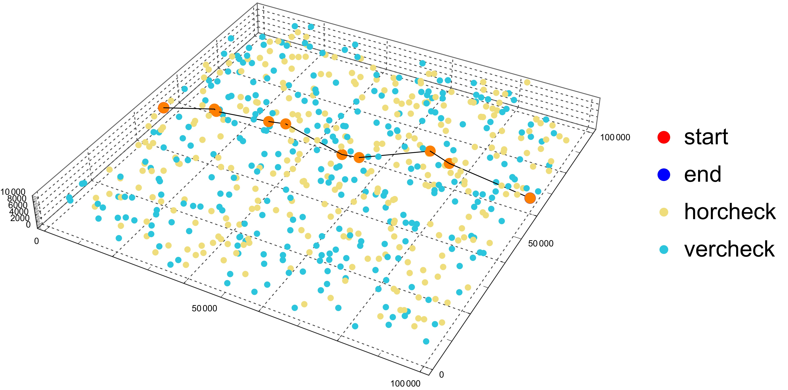
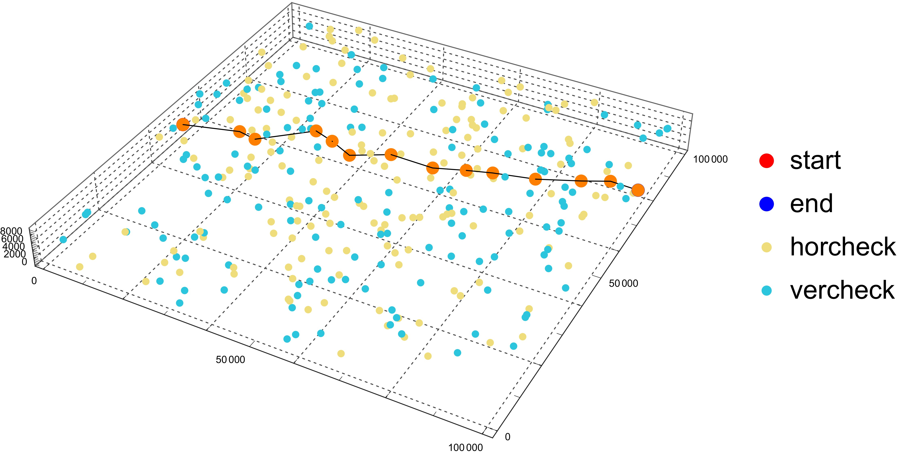
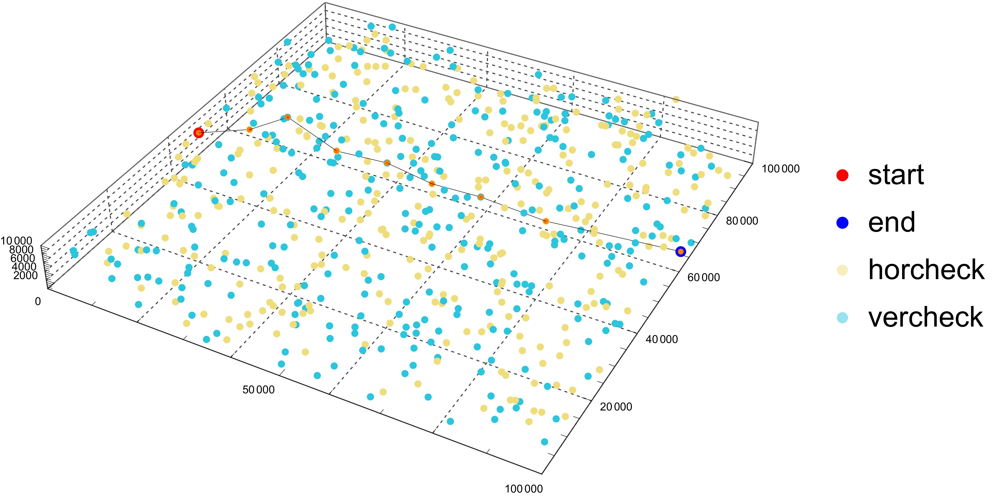
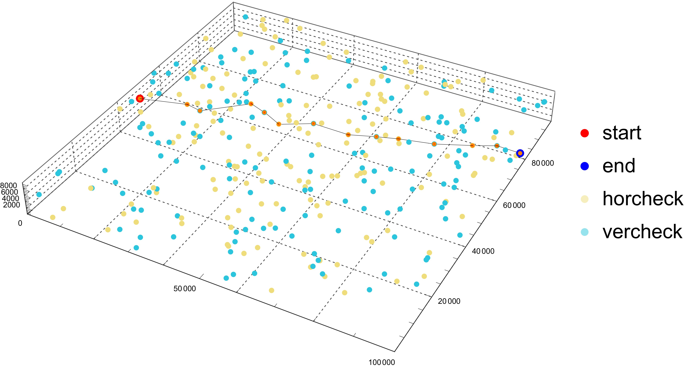
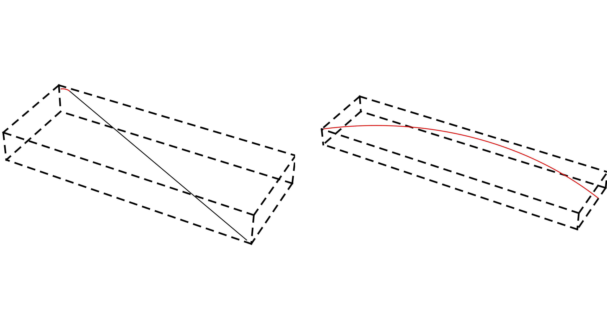

# F题总结
## 题设

飞行器出发点为A, 目的地为B

约束条件:

1. 飞行器每飞1m, 水平误差与垂直误差增加$\delta$. **假设当垂直误差与水平误差均小于$\theta$时, 飞行器仍能按照规划路径飞行**, 也就是说, 只要误差在阈值范围内, 完全不考虑误差对飞行轨迹的影响.
2. 飞行器可以到达垂直校正点或水平校正点将相应误差校正为0, 校正点的位置事先给定且无分布规律.
3. 出发时垂直与水平误差为0
4. x
5. x
6. 当垂直误差$\leqslant\alpha_1$且水平误差$\leqslant\alpha_2$时, 才能进行**垂直误差校正**
7. 当垂直误差$\leqslant\beta_1$且水平误差$\leqslant\beta_2$时, 才能进行**水平误差校正**
8. (问2)飞行器无法完成即时转弯, 最小转弯半径为200m
9. (问3)考虑有部分校正点会出现校正失败的情况, 有$80\%$的概率校正成功, 若校正失败相应误差变成$\min(error,5)$. 会发生校正失败的校正点已知, 但校正成不成功要到了那些校正点才知道


## 问题

- 问1. 满足1~7, 设计航迹, 目标: (1)长度尽可能小(2)校正次数尽可能少, 要讨论算法有效性与复杂度
- 问2. 满足1~7+8, 设计航迹, 目标: (1)长度尽可能小(2)校正次数尽可能少, 要讨论算法有效性与复杂度
- 问3. 满足1~7+9, 设计航迹, 目标: (1)长度尽可能小(2)校正次数尽可能少(3)成功到达终点的概率要尽可能大, 要讨论算法有效性与复杂度

附件中两组数据参数设置:

- 附件1: $\alpha_1=25,a_2=15,\beta_1=20,\beta_2=25,\theta=30,\delta=0.001$
- 附件2: $\alpha_1=20,a_2=10,\beta_1=15,\beta_2=20,\theta=20,\delta=0.001$

## 形式化

设水平误差为$E_h$, 垂直误差为$E_v$. 出发时$E_h=0,E_v=0$

起点坐标为$P_s$, 终点坐标为$P_e$.

起点与终点之间经过的路径目标点有$n$个, 其中校正点有$N_c$

搜寻的路径为$L=\{P_s,P_1,\dots,P_e\}$.

路径总长度为$l=||P_s-P_1||+||P_1-P_2||+\cdots+||P_n-P_e||.$

## 解题

并没有用什么模型和奇技淫巧, 就是个路径搜索算法. 主要思路是将垂直校正点与水平校正点组合搜索(垂直+水平, 水平+垂直), 提高搜索路径的可靠性. 算法使用贪心+回溯+一些剪枝实现. 这里只总结了Q1和Q2.

具体用到的一些优化搜索的技巧大概会总结在博文里吧. 

算法用Python3实现, 带mp的为多进程搜索版本, 可视化Mathematica, 文档$LaTeX$(最后没写完...).

**遗憾的是没有比较标准可靠的答案进行比对, 因此对结果没办法确认是否真正合理正确...**

## 结果

### Q1数据集1

校正次数$N_{se}$: 8

路径总长度$l_{se}$: 104869.7163828774

运行时长: 78.545s



| 校正点编号 | 校正前垂直误差(Ev) | 校正前水平误差(Eh) | 校正点类型 |
| :--------: | ------------------ | ------------------ | :--------- |
|     0      | 0                  | 0                  | 出发点A    |
|    503     | 13.387919852713356 | 13.387919852713356 | 0          |
|    200     | 0.8650578064676826 | 14.252977659181038 | 1          |
|     80     | 16.61495349622301  | 15.749895689755327 | 0          |
|    237     | 21.24269806591272  | 4.6277445696897095 | 1          |
|     27     | 17.733414130458648 | 22.36115870014836  | 0          |
|    375     | 22.349830935733436 | 4.61641680527479   | 1          |
|    448     | 18.586124594625385 | 23.202541399900177 | 0          |
|    485     | 24.31832829886031  | 5.7322037042349265 | 1          |
|    612     | 23.570939229657583 | 29.30314293389251  | 终点B      |

### Q1数据集2

校正次数$N_{se}$: 12

路径总长度$l_{se}$: 109342.28060273973

运行时长: 4.929s



| 校正点编号 | 校正前垂直误差(Ev) | 校正前水平误差(Eh) | 校正点类型 |
| :--------: | ------------------ | ------------------ | :--------- |
|     0      | 0                  | 0                  | 出发点A    |
|    163     | 13.287897610451276 | 13.287897610451276 | 0          |
|    114     | 18.622050934416933 | 5.334153323965658  | 1          |
|     8      | 13.921985777966604 | 19.256139101932263 | 0          |
|    309     | 19.446311179345287 | 5.5243254013786816 | 1          |
|    305     | 5.968714546842516  | 11.493039948221197 | 0          |
|    123     | 15.173107642647263 | 9.204393095804747  | 1          |
|     45     | 10.006161417472903 | 19.21055451327765  | 0          |
|    160     | 17.491295964768753 | 7.48513454729585   | 1          |
|     92     | 5.776163625358746  | 13.261298172654595 | 0          |
|     93     | 15.260882021008982 | 9.484718395650237  | 1          |
|     61     | 9.834209701690867  | 19.318928097341104 | 0          |
|    292     | 16.388123585773872 | 6.5539138840830065 | 1          |
|    326     | 6.960509274778634  | 13.51442315886164  | 终点B      |


### Q2数据集1

校正次数$N_{se}$: 8

路径总长度$l_{se}$: 105181.27257679474

运行时长: 2079.933s



| 校正点编号 | 校正前垂直误差(Ev) | 校正前水平误差(Eh) | 校正点类型 |
| :--------: | ------------------ | ------------------ | :--------- |
|     0      | 0                  | 0                  | 出发点A    |
|    578     | 12.010738484984387 | 12.010738484984387 | 0          |
|    417     | 19.985455372332858 | 7.974716887348471  | 1          |
|     80     | 12.01523558412426  | 19.989952471472733 | 0          |
|    170     | 23.997163088742262 | 11.981927504618003 | 1          |
|    278     | 10.458206587332617 | 22.44013409195062  | 0          |
|    369     | 21.894780751654174 | 11.436574164321557 | 1          |
|    214     | 13.313767496553988 | 24.750341660875545 | 0          |
|    397     | 22.331014793398342 | 9.017247296844355  | 1          |
|    612     | 16.9728585706671   | 25.990105867511453 | 终点B      |

### Q2数据集2

校正次数$N_{se}$: 12

路径总长度$l_{se}$: 109466.14112653787

运行时长: 325.725s



| 校正点编号 | 校正前垂直误差(Ev) | 校正前水平误差(Eh) | 校正点类型 |
| :--------: | ------------------ | ------------------ | :--------- |
|     0      | 0                  | 0                  | 出发点A    |
|    163     | 13.287897610451276 | 13.287897610451276 | 0          |
|    114     | 18.629452713582758 | 5.341555103131481  | 1          |
|     8      | 13.924694482360191 | 19.26624958549167  | 0          |
|    309     | 19.488739087715018 | 5.564044605354828  | 1          |
|    305     | 6.010032285080812  | 11.57407689043564  | 0          |
|    123     | 15.23316818780679  | 9.223135902725977  | 1          |
|     45     | 10.008942859359047 | 19.232078762085024 | 0          |
|    160     | 17.494530535869124 | 7.485587676510075  | 1          |
|     92     | 5.7775284534214535 | 13.263116129931529 | 0          |
|     93     | 15.262721864360147 | 9.485193410938694  | 1          |
|     61     | 9.83421617038282   | 19.319409581321516 | 0          |
|    292     | 16.38847036938614  | 6.554254199003322  | 1          |
|    326     | 6.96905836781789   | 13.523312566821211 | 终点B      |


### 关于图中红色弧线轨迹

在上面Q2结果的轨迹图中, 由于校正点标了颜色和弧线轨迹占整条轨迹的长度小, 因此基本看不清, 下图是某一段两个校正点间带弧轨迹的示例.



Mathematica竟然没有原生绘制空间曲线的函数, Google了一个用Line底层实现的版本...缺点是只能画圆心角小于$\pi$的圆弧.

```mathematica
(*输入为起点 终点 圆心坐标的列表*)
Arc3D[{a_, b_, o_}, n_: 60, prim_: Line] := 
 Module[{nvec, arcangle, R, theta},
  nvec = (a - o)\[Cross](b - o);
  arcangle = VectorAngle[a - o, b - o];
  R = RotationMatrix[theta, nvec];
  prim@Table[o + R.(a - o), {theta, 0, arcangle, arcangle/n}]]
```